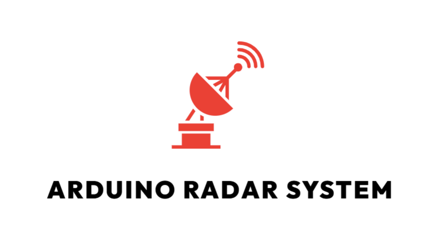
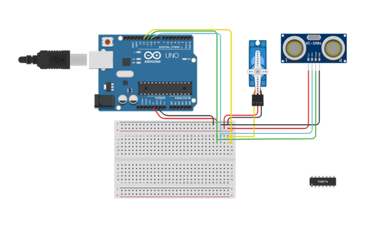
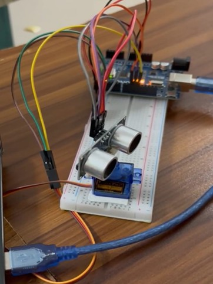
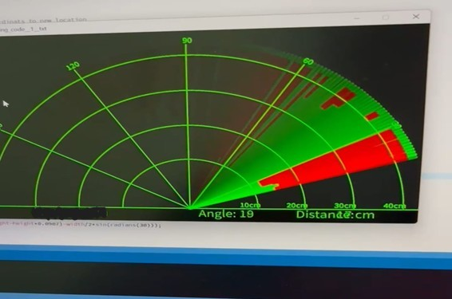

<!-- Logo -->
<p align="center">
  
</p>

<!-- Title Banner -->
<p align="center">
  
</p>

<h3 align="center">
  <b style="color:purple;">📡 Arduino-Based Radar System</b>
</h3>

<h3 align="center">
  <b>🔊 Obstacle Detection and Mapping Using Ultrasonic Sensors</b>
</h3>

<p align="center">
  
  
  
  
</p>


<!-- Overview Banner -->


**Arduino Radar System** is an interactive project demonstrating **real-time obstacle detection** and **position mapping** using **ultrasonic sensors mounted on a servo motor**.  

The sensor rotates across 180° to scan the surrounding environment, while Arduino collects distance data and displays it on the **serial monitor** or software like **Processing**.

**Key Highlights:**
- Detects obstacles and measures distances in real-time  
- Servo motor rotates the ultrasonic sensor for scanning  
- Visualizes object positions using serial output or Processing  
- Modular, Arduino-based hardware design for learning  
- Ideal for robotics beginners, hobbyists, and sensor integration projects  

**Keywords:** Arduino radar, obstacle detection, ultrasonic sensor, servo motor, robotics, real-time scanning, distance mapping


<!-- Objectives -->


- 🎯 Design and implement a basic radar system using Arduino  
- 🔄 Understand ultrasonic sensor operation for distance measurement  
- 📊 Detect obstacles and map their positions  
- 🤖 Demonstrate actuator control using a servo motor  


<!-- Components & Cost -->


<div align="center">

| Component | Quantity | Approx. Cost (BDT) |
|-----------|---------|------------------|
| Arduino UNO | 1 | 760 |
| Ultrasonic Sensor (HC-SR04) | 1 | 100 |
| Servo Motor | 1 | 130 |
| Jumper Wires | 10 | 25 |
| Breadboard | 1 | 50 |
| USB/Power Supply | 1 | 100 |
| **Total Cost** |  | **1,165+** |

</div>


<!-- Features -->


- 📡 Real-time obstacle detection  
- 🔊 Measures distances using ultrasonic sensor  
- ⚙ Servo motor rotates sensor for 180° scanning  
- 💡 Serial monitor/Processing visualization of detected objects  
- 🛠 Modular and easy-to-assemble Arduino setup  
- 📚 Educational and robotics-friendly project  


<!-- System Implementation -->


### 📷 Hardware Setup & Screens
The system integrates Arduino UNO, ultrasonic sensor on a servo motor, and displays distances in real-time.

**Circuit Components:**
- Arduino UNO  
- Ultrasonic Sensor (HC-SR04)  
- Servo Motor (180°)  
- Jumper Wires & Breadboard  
- USB/Power Supply  

**Circuit Diagram:**
<div align="center">

<p><b>Radar System Circuit Diagram</b></p>
</div>

**Operation:**
- Servo rotates ultrasonic sensor across 180°  
- Sensor measures distances to nearby obstacles  
- Data displayed on serial monitor or Processing visualization  

<div align="center">
  
  
  <p><b>Arduino Radar System in Action</b></p>
</div>


<!-- Project Structure -->


```bash
Arduino-Radar-System/
│── Arduino_Code/
│ ├── RadarSystem.ino
│ ├── circuit_diagram.png
│ ├── radar_demo.png
│── README.md
```


<!-- Setup & Usage --> 

Steps to Run:
```bash
1. Connect ultrasonic sensor to Arduino UNO as per the circuit diagram  
2. Mount sensor on servo motor for scanning    
3. Upload RadarSystem.ino to Arduino using Arduino IDE  
4. Power Arduino via USB or external supply  
5. Open serial monitor or Processing to view distance mapping  
6. Observe sensor scanning and distance detection in real-time  
```
 

<!-- Future Work --> 

📡 Add multi-sensor scanning for larger areas   
🤖 Integrate with autonomous robots for obstacle navigation  
💬 Display visualization on external dashboard   
🔋 Optimize power efficiency and add battery monitoring  

 


<!-- Conclusion --> 


Arduino Radar System demonstrates real-time obstacle detection and distance mapping using ultrasonic sensors and a servo motor.

It serves as an educational project, hobbyist prototype, or basis for more advanced robotic applications.

 

<!-- Author --> 


### A. K. M. Masudur Rahman (Gaurab)

🎓 Department of Computer Science and Engineering (CSE)   
🏫 Bangladesh Army University of Science and Technology (BAUST), Saidpur   
📧 Email: akmmasudurrahmangaurab@gmail.com   

 

<!-- Support --> 


If you like this project, consider giving it a ⭐ on GitHub!
